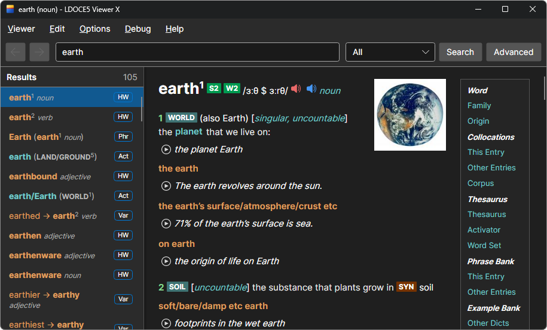

# LDOCE5 Viewer X

LDOCE5 Viewer X is a desktop dictionary viewer for the Longman Dictionary of
Contemporary English 5th Edition.

LDOCE5 Viewer X is a cross-platform rewrite of the original [ciscorn/ldoce5viewer](https://github.com/ciscorn/ldoce5viewer) for Windows, Linux, and macOS.

The original version was written in Python, but this version is implemented in C# and Avalonia.



## Supported Platforms

- Windows x64 and arm64
- Linux x64 and arm64
- macOS x64 and arm64

For other systems and architectures, you can build it yourself.

## Features

- Implemented all features found in the original version, except for printing
- Native desktop builds for Windows, Linux, and macOS by .NET AOT
- Supports dark mode that adapts to the operating system
- Stable audio playback by [miniaudio](https://github.com/mackron/miniaudio)
- Customizable appearance such as fonts and sizes

## Getting Started

1. Download the package for your operating system from the [release](https://github.com/umlx5h/LDOCE5ViewerX/releases) artifacts:
   - Windows: extract `LDOCE5ViewerX-win-*.7z`, then run `LDOCE5ViewerX.exe`.
   - Linux: make `LDOCE5ViewerX-linux-*.AppImage` executable, then run it.
   - macOS: extract `LDOCE5ViewerX-osx-*.7z`, then move
     `LDOCE5 Viewer X.app` to `/Applications` or another folder.

2. On macOS, remove quarantine attributes from the extracted app before the
   first launch:

   ```bash
   xattr -cr /Applications/LDOCE5\ Viewer\ X.app
   ```

3. Prepare the `ldoce5.data` folder from your purchased
   [Longman Dictionary of Contemporary English 5th Edition DVD](https://www.amazon.com/dp/1408215330).

4. Start LDOCE5 Viewer X. If no usable index exists, the `Create Index` dialog
   opens automatically. You can also open it later from
   `Viewer` > `Recreate Index...`.

5. In the `Create Index` dialog, click `Browse...` and select the `ldoce5.data`
   folder itself, not its parent folder. Then click `Start Indexing` and wait.

6. After indexing finishes, search for a word to confirm that entries display.
   Press `F1` to open the built-in help window and view the keyboard shortcuts.

## Requirements

### Development

Install these on every development machine:

- [.NET 10 SDK](https://dotnet.microsoft.com/download/dotnet/10.0)

### Publishing

- [PowerShell 7](https://learn.microsoft.com/powershell/)
- [just](https://github.com/casey/just)

- Windows: `7-Zip`
- Linux: `curl`
- macOS: `p7zip`

## Development Build

Run commands from the repository root.

```powershell
dotnet run --project LDOCE5ViewerX
dotnet build LDOCE5ViewerX
```

To build and run during development from an IDE, open
`LDOCE5ViewerX.slnx` and use the `LDOCE5ViewerX` project as the startup
project.

The recommended IDEs are Visual Studio or JetBrains Rider.

## Packaging

Packaging uses PowerShell 7 scripts through just. GitHub Actions calls these
same recipes.

```powershell
just publish-win-x64
just publish-win-arm64
just publish-linux-x64
just publish-linux-arm64
just publish-osx-x64
just publish-osx-arm64
```

## Development Notes

It has been rewritten primarily using Codex GPT-5.5.
I have manually provided instructions, verified functionality, and adjusted the code carefully.

## License

LDOCE5 Viewer X is licensed under the GNU General Public License version 3 or later, matching the original LDOCE5 Viewer license. See [LICENSE](LICENSE).

This project is a C# / Avalonia rewrite of the original LDOCE5 Viewer by Taku Fukada. Copyright and attribution notices are listed in [NOTICE.txt](NOTICE.txt).

## Libraries

Runtime application libraries:

- [.NET 10](https://dotnet.microsoft.com/download/dotnet/10.0)
- [Avalonia](https://avaloniaui.net)
- [CommunityToolkit.Mvvm](https://github.com/CommunityToolkit/dotnet)
- [LeanCorpus](https://github.com/jordansrowles/LeanCorpus)
- [JAJ.Packages.MiniAudioEx](https://github.com/japajoe/miniaudioex)
